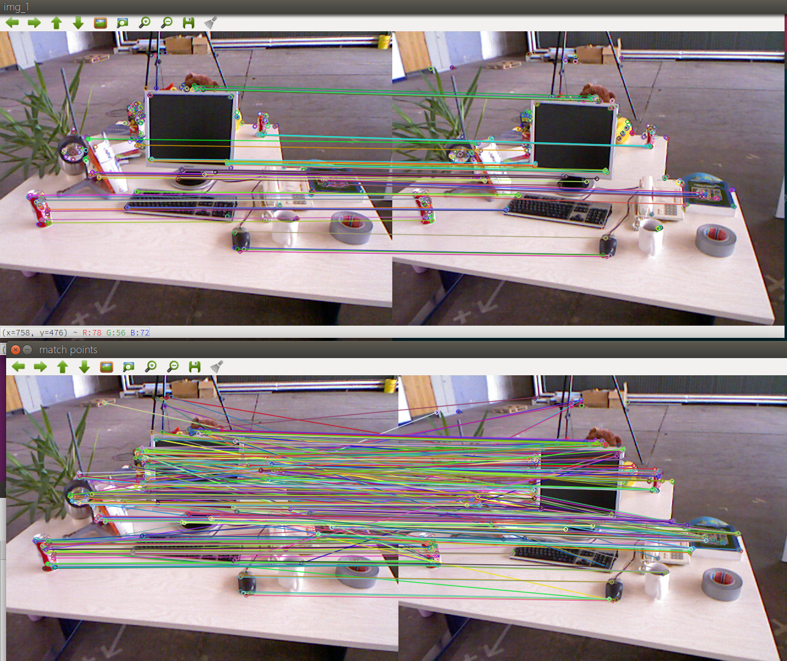

# 调试笔记

词袋模型，并通过 DBoW  


## ch7

#### 1 特征点提取

**note：** opencv中函数使用中文可能导致显示异常

`g2o`和具体版本有关，调试使用最新版本

```
mkdir build 
cd build 
cmake ../
make 
cd ../
./build/feature_extraction 1.png 2.png =
```

```
[ INFO:0] Initialize OpenCL runtime...
-- Max dist : 95.000000 
-- Min dist : 7.000000
```



`Esc`退出


**存疑**

如下

```
  Ptr<FeatureDetector> detector = ORB::create();
  Ptr<DescriptorExtractor> descriptor = ORB::create();
```


#### 2 对极约束求相机约束


